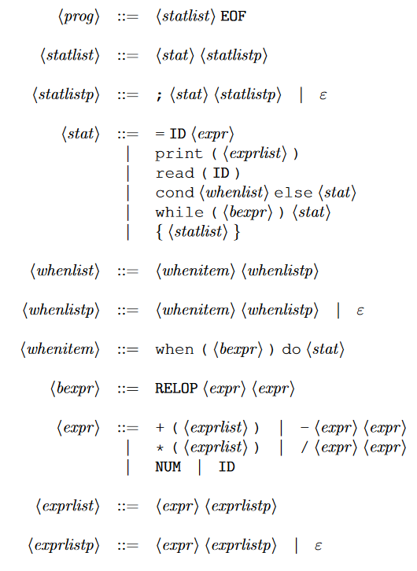

# Grammatica di partenza

# Calcolo giude
| Simbolo    | Guide                                                                  | follow                      | first                                           |
|------------|------------------------------------------------------------------------|-----------------------------|-------------------------------------------------|
| prog       | (prog->statlistp)= First(statlistp U EOF)=; ,EOF                    | $                           | first(statlist)                                 |
| statlist   | (->stat statlistp)=FIRST(stat,statlistp)===,ID,PRINT,READ,WHILE,COND,{ | EOF,}                       | stat,statlistp==,ID,PRINT,READ,WHILE,COND,{,;   |
| statilistp | (->;...)=; (->$\epsilon$)=FOLLOW(statlistp)==EOF, }                 | EOF, }                      | ;                                               |
| stat       | (->=..)= {=} (->print..)={print} (->cond..)={cond} (->while..)={while} (->{...)={'{'} | ;  EOF  }                   | =,ID,PRINT,READ,WHILE,COND,{                    |
| whenlist   | (->whenitem, whenlistp)=FIRST(whenitem, whenlistp)                     | else                        | FIRST(whenitem) U FIRST(whenlistp)=when         |
| whenlistp  | (->whenitem, whenlistp)=FIRST(whenitem, whenlistp)=when,else (->$\epsilon$)=follow(whenlistp)= else | else                        | FIRST(whenitem)=when                            |
| whenitem   | (->when ...)=when                                                      | when,else                   | when                                            |
| bexpr      | ->RELOP=RELOP                                                          | )                           | RELOP                                           |
| expr       | (->+ ... )=+ (->- ... )=- (->* ... )=* (->/... )= / (->NUM )=NUM (->ID)=ID | ;  EOF , +,-,*,/,  NUM,ID,) | +,-,*,/,  NUM,ID                                |
| exprlist   | (->expr exprlistp)={+,-,*,/,ID,NUM}                                 | )                           | FIRST(expr) U FIRST(exprlistp)=+,-,*,/,  NUM,ID |
| exprlistp  | (->expr,exprlistp)={+,-,*,/,ID,NUM} (->$\epsilon$)=follow(exprlist)=) | )                           | FIRST(expr)=+,-,*,/,  NUM,ID                    |
